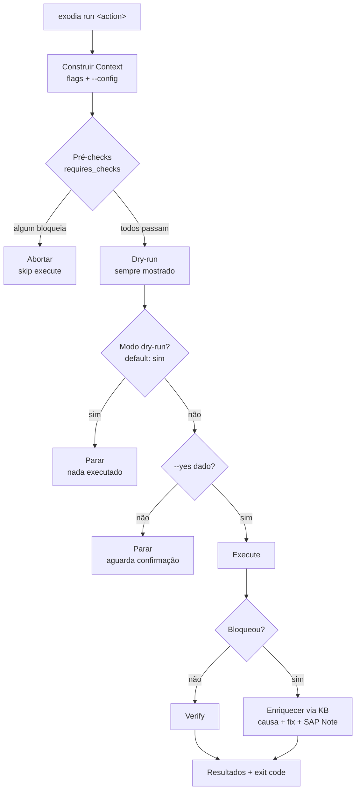

# Arquitetura

Exodia segue um modelo **Head + Limbs** (Cabeça + Membros): um núcleo pequeno e
estável (a Cabeça) que descobre e orquestra um conjunto crescente de operações
plugáveis (os Membros). O núcleo nunca sabe, à partida, que módulos existem — descobre-os
em tempo de execução. Adicionar uma capacidade nova é largar um ficheiro em
`exodia/modules/`; não há registo central para editar.

## Princípios

- **Stateless** — cada invocação constrói um `Context`, corre e termina. Sem memória,
  sem base de dados própria, sem *phone-home*.
- **Duas categorias, um modelo de segurança:**
    - **Checks** são só-leitura. Seguros de correr em qualquer sítio, a qualquer hora.
    - **Actions** mudam estado. São *guardadas*: pré-checks → dry-run → confirmação →
      execução → verificação → rollback documentado.
- **Seguro por construção** — comandos são sempre listas de argumentos, **nunca**
  `shell=True`. Segredos nunca vão para o log. SSH usa verificação de *host key*.
- **Plugável** — o registry auto-descobre módulos sob `exodia/modules/`.
- **Auto-suficiente** — uma KB de troubleshooting embutida mapeia erros conhecidos para
  causa + fix genérico + **número de SAP Note** (referimos números, nunca o texto).

## Os componentes

### 1. CLI router (`cli.py`) — a Cabeça

Um router [Typer](https://typer.tiangolo.com/) com três comandos:

- `exodia list` — mostra todos os checks e actions descobertos.
- `exodia run <nome>` — corre um check ou uma action guardada por nome.
- `exodia doctor` — self-check: confirma o setup e a descoberta.

O CLI constrói o `Context` a partir das flags e de um `--config <exodia.yaml>`
opcional, e delega a execução ao runner. É a única camada que fala com o utilizador.

### 2. Registry auto-discovery (`core/registry.py`)

O registry percorre o pacote `exodia.modules` (mais os core checks), importa cada
submódulo, e recolhe todas as subclasses de `Check` e `Action` que tenham um `name`.
Um singleton (`registry`) indexa-os por nome dotted. Não há wiring central — largar
um módulo novo em `modules/` fá-lo aparecer no `exodia list` automaticamente.

### 3. Check / Action base (`core/base.py`)

A distinção que forma a espinha dorsal da segurança:

- **`Check`** — implementa `run(ctx) -> Result`. Só-leitura. Um wrapper `execute()`
  apanha exceções e enriquece falhas bloqueantes a partir da KB.
- **`Action`** — implementa `dry_run()`, `execute()`, `verify()` e (opcionalmente)
  `rollback()`. Declara `requires_checks` — os checks que **têm** de passar antes.

### 4. Fluxo guardado de 6 passos

Quando corres uma action, o runner (`core/runner.py`) aplica sempre esta sequência:

1. **Pré-checks** — corre os `requires_checks` da action. Se algum bloquear, aborta.
2. **Dry-run** — descreve exatamente o que `execute()` faria, sem o fazer. É sempre
   mostrado. Em modo dry-run (o **default**), para aqui.
3. **Confirmação** — sem `--yes`, pára e pede confirmação explícita.
4. **Execução** — corre `execute()`. Se falhar, enriquece com a KB e **não** verifica.
5. **Verificação** — `verify()` confirma que a action atingiu o objetivo.
6. **Rollback** — reversão *best-effort*; por omissão, documentada (aponta runbook/SAP Note).



### 5. Shell / SSH seguro (`core/shell.py`)

Regra dura: **nunca `shell=True`**. Comandos são sempre `list[str]` passadas
diretamente ao processo, o que elimina injeção de shell como classe de bug. O
`Context.runner()` devolve um `Runner` local ou um `SSHRunner` remoto (com
verificação de *host key* via paramiko). Segredos passam por stdin, nunca por argv.

### 6. KB de troubleshooting embutida (`core/knowledge.py`)

Ficheiros YAML em `knowledge/errors/` mapeiam padrões de erro (regex) para causa,
fix genérico e número de SAP Note. Quando um check/action falha de forma bloqueante,
`enrich()` procura na KB e anexa a remediação ao `Result`. Sem RAG, sem LLM — tudo
estático e versionado no repo.

!!! warning "Regra de IP"
    A KB refere **números** de SAP Note e fixes de conhecimento público. **Nunca**
    reproduz o texto das SAP Notes (copyright SAP, atrás de login). Nada de dados de
    clientes reais.

### 7. Context stateless (`core/context.py`)

O `Context` carrega tudo o que um check/action precisa: seleção de alvo (host, user,
port), parâmetros SAP/DB (db_type, sid, source, target), flags de comportamento
(dry_run, assume_yes, skip_checks) e a *escape hatch* (`params`, pre/post hooks).
É construído por invocação e descartado no fim.

A partir do TIA-55, o `Context` pode ser construído de um [`ExodiaConfig`](getting-started.md)
validado (`Context.from_config`) ou de um ficheiro (`Context.from_file`, que valida
via schema Pydantic). Os campos tipados aterram nos atributos do Context **e** ficam
acessíveis pela API `ctx.get(...)` — retrocompatibilidade total com os módulos existentes.

## Fluxo de dados de um `exodia run`

```
flags CLI + exodia.yaml
        │
        ▼
   ExodiaConfig  ──(valida)──►  ConfigError amigável se inválido
        │
        ▼
    Context  ──►  Registry (resolve nome)  ──►  Runner
        │                                          │
        │                              ┌───────────┴───────────┐
        ▼                              ▼                       ▼
   ctx.get(...)                     Check.execute()      Action.run_guarded()
   ctx.runner()                          │                     │
   (Runner/SSHRunner)                    ▼                     ▼
                                      Result  ◄──enrich(KB)──►  Result
                                          │                     │
                                          └────────►  report  ◄─┘
                                                    (tabela/JSON + exit code)
```
