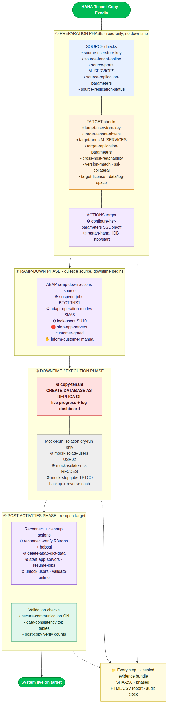

# HANA Tenant Copy — complete Exodia coverage

Everything Exodia does for a HANA cross-host tenant copy, mapped to the four
cutover phases. Derived from the real ENERSUISSE P40 dry-run runbook.



*(Source: [`tenant-copy-flow.mmd`](tenant-copy-flow.mmd) — regenerate with
`mmdc -i docs/tenant-copy-flow.mmd -o docs/assets/tenant-copy-flow.png -b white`.)*

Legend: **CHECK** = read-only validation · **ACTION** = guarded state change
(dry-run → confirm → execute → verify) · ⛔ customer-confirmation gate ·
✋ manual attestation.

---

## ① Preparation Phase — read-only, no downtime

**Source checks** (run in the customer network):

| Check | What it does |
|---|---|
| `source-userstore-key` | source SYSTEMDB hdbuserstore key present (`hdbuserstore LIST`) |
| `source-tenant-online` | source tenant exists + ONLINE (`M_DATABASES`) |
| `source-ports` | source HANA service ports incl. SQL/replication port (`M_SERVICES`) |
| `source-replication-parameters` | source HSR/SSL/persistence keys (`M_INIFILE_CONTENTS`) |
| `source-replication-status` | source not mid-HSR to elsewhere (`M_SERVICE_REPLICATION`) |

**Target checks** (run in the HEC network):

| Check | What it does |
|---|---|
| `target-userstore-key` | target SYSTEMDB key present |
| `target-tenant-absent` | target tenant name free (no overwrite) |
| `target-ports` | target HANA service ports (`M_SERVICES`) |
| `target-replication-parameters` | target HSR/SSL/persistence keys |
| `cross-host-reachability` | target reaches source SQL port (`nc`) |
| `version-match` | target HANA revision ≥ source |
| `ssl-collateral` | TLS trust store present for encrypted copy |
| `target-license` | target HANA license valid (`M_LICENSE`) |
| `target-data-space` / `target-log-space` | target volumes have room (`df`) |

**Actions** (target SYSTEMDB):

| Action | What it does |
|---|---|
| `configure-hsr-parameters` | apply SR tuning + SSL params (`ALTER SYSTEM … WITH RECONFIGURE`); **SSL on/off** selectable; flags restart-required |
| `restart-hana` | `HDB stop` + `HDB start` when parameters need it |

Runbooks: `tenant-copy.hana.readiness-source`, `tenant-copy.hana.readiness-target`
(air-gapped) or `tenant-copy.hana.readiness` (single host). Profile backup:
`abap.profile-backup`.

## ② Ramp-Down Phase — quiesce the source (downtime begins)

| Action | Transaction | Notes |
|---|---|---|
| `abap.rampdown.suspend-jobs` | BTCTRNS1 | suspend the background scheduler |
| `abap.rampdown.adapt-operation-modes` | SM63 | ramp-down operation mode |
| `abap.rampdown.lock-users` | SU10 | spares DDIC/SAP*/TMSADM + keep-list |
| `abap.rampdown.stop-app-servers` | sapcontrol | ⛔ **customer-confirmation gated** |
| `abap.rampdown.inform-customer` | — | ✋ **manual** (admin emails customer) |

## ③ Downtime / Execution Phase

| Action | What it does |
|---|---|
| `copy-tenant` | `CREATE DATABASE … AS REPLICA OF …` — typed-name confirm, **live progress bar + log dashboard**, replication-sync polling, reinforced verify |
| `mock-isolate-users` | **dry-run only** — lock USR02 (backup + reverse) |
| `mock-isolate-rfcs` | **dry-run only** — neutralise RFCDES (backup + reverse) |
| `mock-stop-jobs` | **dry-run only** — stop TBTCO jobs (backup + reverse) |

## ④ Post-Activities Phase — re-open the target

**Actions:**

| Action | What it does |
|---|---|
| `reconnect-verify` | test DB connection (`hdbsql -U DEFAULT`) + transport (`R3trans -x`) |
| `delete-abap-dict-data` | clear migration-stale monitoring/dict tables (ALCONSEG, PAHI, DDLOG, …) |
| `abap.post.start-app-servers` | sapcontrol StartSystem |
| `abap.post.resume-jobs` | BTCTRNS2 |
| `abap.post.unlock-users` | BAPI_USER_UNLOCK |
| `abap.post.validate-online` | SM51 online validation |

**Checks:**

| Check | What it does |
|---|---|
| `secure-communication` | `system/secure_communication` = ON (ECS mandatory) |
| `data-consistency` | top-N tables by record count match source vs target (`M_TABLES`) |

---

## Evidence (all phases)

Every check and action writes to a sealed, tamper-evident evidence bundle
(SHA-256 per artifact). Produce the phased report any time:

```bash
exodia report --format html    # phase-grouped, verdict banner, findings
exodia report --format csv     # opens in Excel
exodia history                 # when / duration / verdict per run
```

## Cross-network (air-gapped) model

```bash
# in the customer (source) network — capture a signed snapshot:
exodia snapshot tenant-copy.hana.readiness-source --side source --config source.yaml -o source.json
# carry source.json across, then in the HEC (target) network — diff it live:
exodia compare source.json --against tenant-copy.hana.readiness-target --side target --config target.yaml
```

Print the whole day-of playbook with `exodia cutover-plan`.
